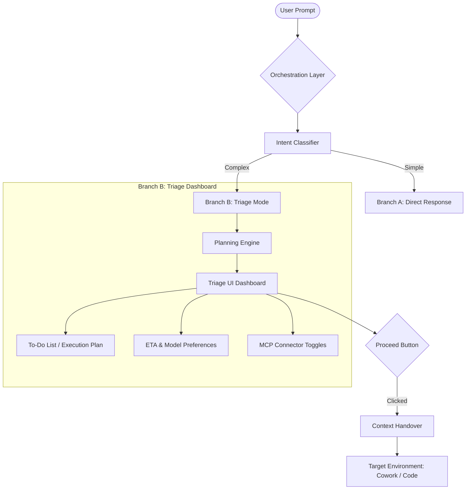
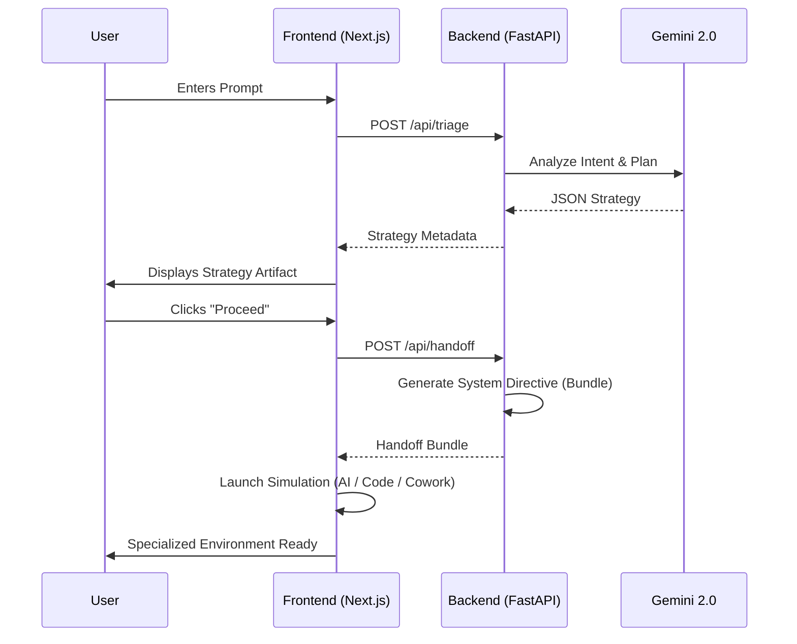

# Claude Orchestration Layer

Achieve a pixel-perfect, feature-rich orchestration experience designed to eliminate friction in the Claude ecosystem. This layer acts as an intelligent gateway, analyzing user intent and providing high-fidelity "Triage Dashboards" before delegating tasks to specialized environments (Claude AI, Cowork, or Code).

## ✨ 🎨 Claude Carbon UI
The interface is a pixel-perfect replication of the native Claude.ai design system, featuring:
- **Peach/Orange Aesthetic**: Consistent brand iconography (`＊`) and color palettes.
- **Premium Components**: Sonnet 4.7 badges, wave-form voice icons, and serif-typography greetings.
- **Simulation Environments**:
    - **Claude AI**: High-fidelity chat with "Artifact Cards" and Gmail integration.
    - **Claude Code**: Authentic terminal simulation with pixelated character logos and step-by-step output formatting.
    - **Claude Cowork**: Triple-pane layout (Navigation, Chat, and Progress/Context panel).

## 🚀 Core Features
- **Intelligent Triage**: Automatically branches between simple direct responses and complex orchestration plans.
- **Strategy Artifacts**: High-fidelity execution plans with ETAs, model recommendations, and MCP tool discovery.
- **New Chat Logic**: Fully functional sidebar button to reset the orchestration session seamlessly.
- **Context Preservation**: Intelligent handover of prompt metadata between environments.

## 🔄 System Workflow


## 🔄 User Data Flow


## 📂 Project Organization
The project is organized into historical phases for clear roadmap visibility:
- **`Phases/Phase 1 - The Sorter`**: Intent classification and branching logic.
- **`Phases/Phase 2 - The Strategist`**: Strategic planning and metadata engine.
- **`Phases/Phase 3 - The Connector`**: MCP tool management and discovery.
- **`Phases/Phase 4 - The Hub`**: Premium Next.js frontend (Claude Carbon).
- **`Phases/Phase 5 - The Handover`**: Context persistence and routing.

## 🛠️ Getting Started

### 1. Backend (FastAPI)
Run the orchestration server:
```bash
python3 -m uvicorn api.index:app --port 8000 --reload
```

### 2. Frontend (Next.js)
Launch the Claude Carbon Dashboard:
```bash
npm run dev
```

## 🏁 Technical Overview
Refer to [architecture.md](./architecture.md) for a detailed technical breakdown of the multi-agent orchestration logic and design tokens.

---
*Built to provide a premium, friction-less experience for agentic workflows.*
