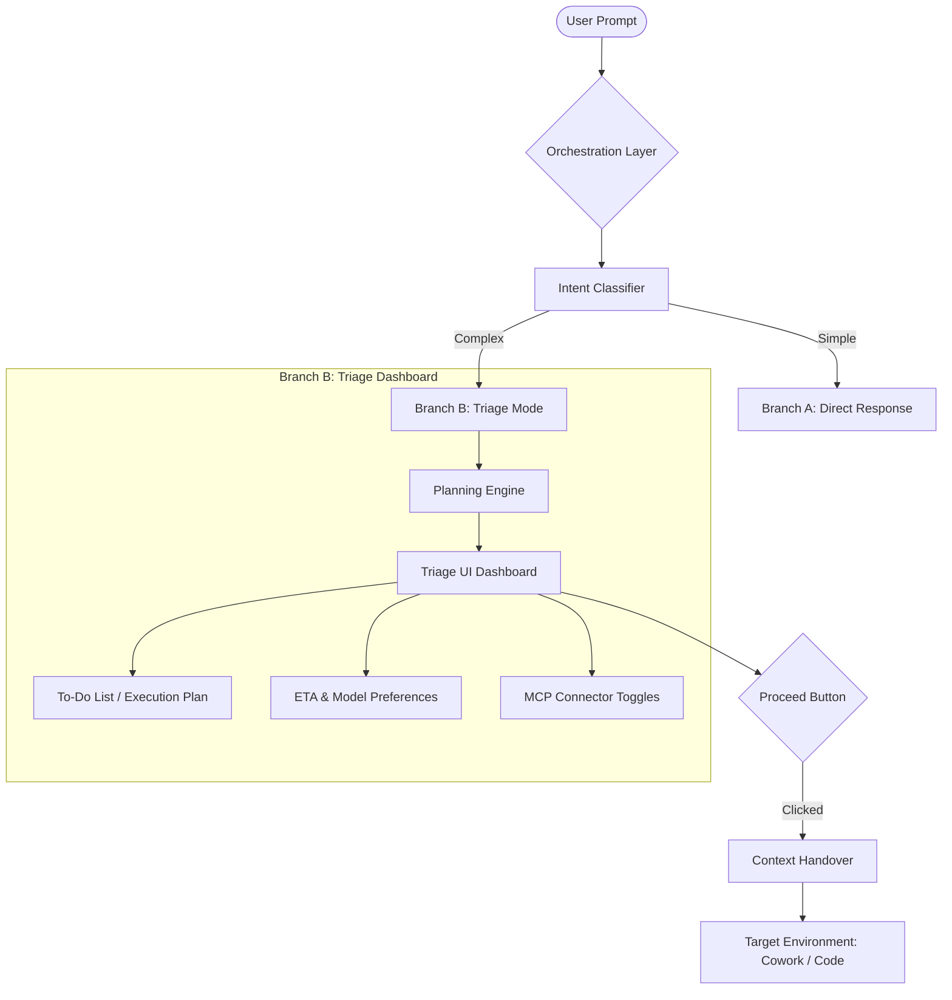
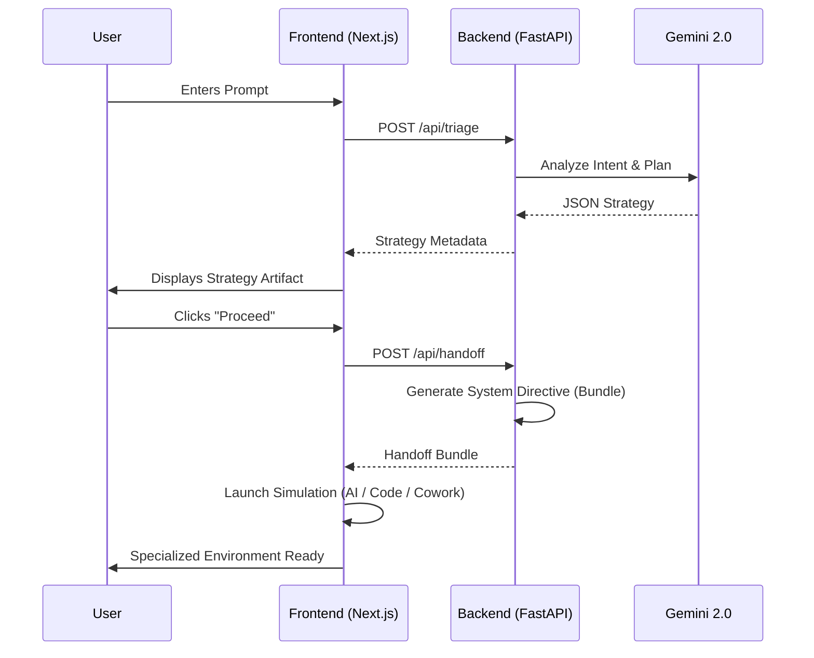

# Claude Orchestration Layer: System Architecture

## Overview
The Claude Orchestration Layer is a middleware system designed to eliminate "choice paralysis" for users of the Claude ecosystem. It acts as an intelligent gateway that analyzes user intent and provides a structured "Triage Dashboard" before delegating tasks to the most efficient Claude environment (Claude AI, Cowork, or Code).

## System Workflow

## 🔄 User Data Flow

## Phase-Wise Implementation Status (Complete)

### ✅ Phase 1: Foundation & Intent Classification
- **Location**: `Phases/Phase 1 - The Sorter/`
- **Modules**: `classifier.py`, `utils.py`
- **Function**: Standardizes prompts and uses Gemini 2.0 to categorize intent (Simple vs. Complex).

### ✅ Phase 2: Planning & Metadata Engine
- **Location**: `Phases/Phase 2 - The Strategist/`
- **Modules**: `planner.py`
- **Function**: Decomposes complex tasks into actionable strategic plans with ETAs and model recommendations.

### ✅ Phase 3: MCP & Tooling Bridge
- **Location**: `Phases/Phase 3 - The Connector/`
- **Modules**: `mcp.py`
- **Function**: Maps task requirements to available Model Context Protocol connectors.

### ✅ Phase 4: Claude Carbon UI Dashboard
- **Location**: `Phases/Phase 4 - The Hub/`
- **Key Files**: `page.tsx`, `globals.css`
- **Aesthetic**: Premium "Claude Carbon" design system with high-fidelity simulations for all environments.

### ✅ Phase 5: Transition & Context Management
- **Location**: `Phases/Phase 5 - The Handover/`
- **Modules**: `context_manager.py`, `index.py`, `next.config.js`
- **Function**: Handles session persistence and intelligent handoff to target environments.

---

## Technical Stack
- **Backend**: FastAPI (Python 3.10+)
- **Frontend**: Next.js 14 + Tailwind CSS + Framer Motion
- **LLM**: Google Gemini 2.0 (via `google-genai` SDK)
- **Styling**: Claude Carbon Design Tokens (defined in `globals.css`)

## Vercel Deployment Strategy
Yes, this project is highly compatible with Vercel's ecosystem. 

1. **Next.js Frontend**: Direct deployment on Vercel with edge runtime optimizations for the Triage Dashboard.
2. **FastAPI Backend**: Can be deployed as **Vercel Serverless Functions** (contained in the `api/` directory). This allows the entire project to live in a single repository.
3. **Session Management**: Since Vercel is serverless, we recommend using **Upstash Redis** (which is also Vercel-friendly) to handle the cross-environment context handover.
4. **Environment Switching**: Vercel's high-speed edge functions ensure the "Proceed" button logic executes with minimal latency before redirecting the user to the target Claude environment.

> [!TIP]
> To avoid Vercel's serverless timeout limits (10s on Hobby), the "Planning Engine" (Phase 2) should use **Streaming Responses** or an asynchronous architectural pattern if the task decomposition takes longer than a few seconds.
